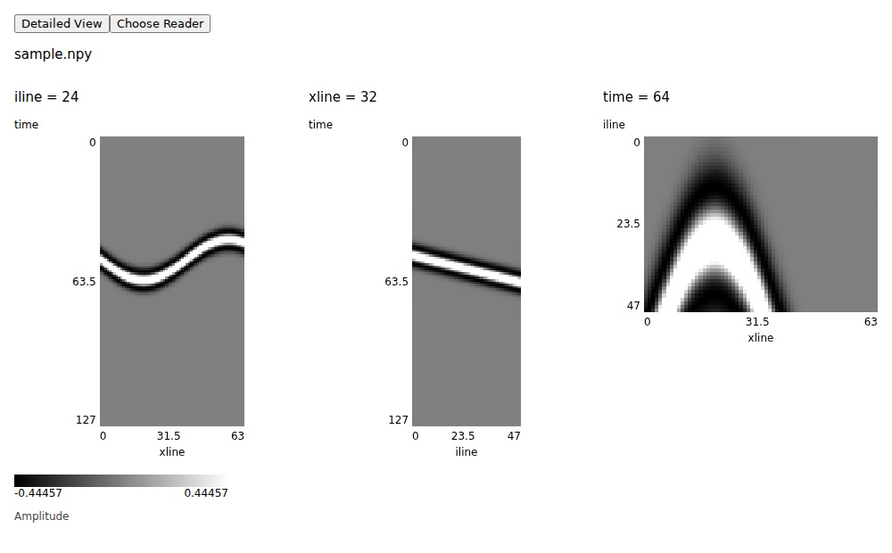

# DataPeek


[English](README.md) | 简体中文

轻量科学数据预览插件：快速查看数据形态，按需检查切片，并通过 Python 脚本支持自己的格式。

作者：Jintao Li · [lijintaobt@gmail.com](mailto:lijintaobt@gmail.com)

## 开始使用

1. 在 VS Code 1.90+ 中运行 **Extensions: Install from VSIX...**，安装分享包提供的 `datapeek-0.0.1.vsix`。
2. 在 Python 3.10+ 环境中安装 `numpy` 和 `matplotlib`。HDF5 需要 `h5py`，Zarr 需要 `zarr`；详细查看需要 `plotly`，3D 和 Petrel 配色需要 `cigvis[viser]`。
3. 运行 **DataPeek: Select Python Interpreter** 选择解释器。
4. 右键文件或支持的数据目录，选择 **Preview with DataPeek**。

使用 Remote SSH 时，Python 依赖和读取脚本应安装在远端。预览在当前编辑器组打开。更新插件后，执行 **Developer: Reload Window** 并重新打开已有预览。

第一次使用请按[安装与首次预览](docs/getting-started.zh-CN.md)操作，包含依赖安装命令、小型测试数据、Settings JSON 入口和常见问题。使用插件无需安装 Node.js/npm。



## 支持的数据

| 读取方式 | 用途 |
| --- | --- |
| 内置读取器 | NPY、NPZ、HDF5、Zarr 中的通用一维、二维和三维数组 |
| 自定义数组读取器 | 适配字段名称、坐标约定或文件格式，复用预览和详细查看控件 |
| 自定义 Figure 绘图器 | 自己绘制 Matplotlib 或 Python Plotly 图，包括叠加图层 |

容器包含多个数组时，通过 `dataset` 参数指定字段。三维数据采用 `(iline, xline, time)` 顺序。内置读取器展示原始数值，预处理由自定义脚本完成。

点击 **Choose Reader** 切换读取方式；成功打开后，DataPeek 会为该文件记住选择。详见[自定义读取器和参数](docs/custom-readers.zh-CN.md)及 [DAS/地震示例](docs/real-data-debug.zh-CN.md)。

## 查看细节

快速预览显示静态概览。数组读取器可通过 **Detailed View** 在同一标签页进入 Plotly。

| 控件 | 作用 |
| --- | --- |
| Axis、Slice | 选择三维切片；滑块松开后读取 |
| 缩放、平移 | 操作已加载图像，不读取更多数据 |
| Read Visible Region | 读取当前可见区域的更多细节 |
| Full View | 返回已加载的概览 |
| vmin/vmax、Colormap、Apply | 调整色阶和配色，不重新读取数据 |
| Reset Defaults | 恢复读取器配置的显示默认值 |

快速预览和详细查看都同时适配窗口的宽度与高度。默认保留原始切片的行列比例；折线图使用 2:1。在详细查看中，取消 **Original aspect**，再设置 **W/H**，即可指定显示宽高比（例如 `2` 表示 2:1）。设置会按视图记住，不会重新读取数据或改变色阶。读取器默认参数可设置 `"preserve_aspect": false, "aspect_ratio": 2`，这些参数也适用于快速预览。

色阶初始化后保持固定，直到手动修改或重置。仅缩放不会提高数据分辨率。配色包括 `gray`、`seismic`、`RdBu_r`、`viridis` 和 `Petrel`。

三维数组可用 **3D View** 在独立标签页打开 cigvis，也可通过 **Open in Browser** 在浏览器打开。按新切片设置重建前，先点击 **Stop 3D**。关闭 3D 标签页会停止服务，仅关闭外部浏览器标签页不会停止服务。

## 单击预览

运行 **DataPeek: Toggle Automatic Preview**，临时让匹配文件直接在 DataPeek 中打开。再次运行可关闭，重载窗口也会恢复原文件关联。开启后，请关闭已有文本标签并重新打开文件。

默认匹配 NPY、NPZ、H5、HDF5，可通过 `datapeek.autoPreviewPatterns` 添加文件模式。目录仍按原方式展开，需要右键预览。`datapeek.previewExcludedPaths` 可从右键菜单中排除容器路径。

## 大文件与缓存

预览会限制显示分辨率。三维数据未压缩体积不超过 1.5 GB 时，默认显示三个中间切片；更大时默认只显示 iline。每个选中切片都完整读取，可通过 `slices` 覆盖默认选择。

压缩格式可能需要解码比显示区域更多的数据。通用 NPZ 读取器需完整解压所选数组；需要局部读取的大数据更适合使用 NPY/Zarr。

预览缓存默认上限为 100 项、512 MiB，7 天未访问过期。使用 `datapeek.cache.*` 配置，或运行 **DataPeek: Clear Preview Cache** 清除。自定义数组读取器可显式启用缓存，Figure 绘图器不缓存。

## 添加自定义查看器

将 Python 脚本放在工作区根目录的 `.datapeek/`，或个人目录 `~/.datapeek/readers/` 中跨项目复用。插件会提供 `datapeek` SDK。

```python
from datapeek import viewer

@viewer.reader(name="Text array", extensions=[".txt"])
def read(path, options):
    import numpy as np
    return np.loadtxt(path)
```

叠加示例 [seismic_fault_demo.py](examples/seismic_fault_demo.py) 从阻抗生成地震道并叠加断层。安装方法、计算假设和参数见脚本及[示例说明](docs/real-data-debug.zh-CN.md#合成地震与断层叠加)。

## 帮助与开发

错误和诊断可在 **Output → DataPeek** 查看。缺少依赖时，请检查选中的 Python 环境。读取脚本会执行 Python 代码，需要受信任的工作区。

- [自定义读取器与配置](docs/custom-readers.zh-CN.md)
- [DAS 与地震示例](docs/real-data-debug.zh-CN.md)
- [开发与测试](docs/implementation-plan.zh-CN.md)
